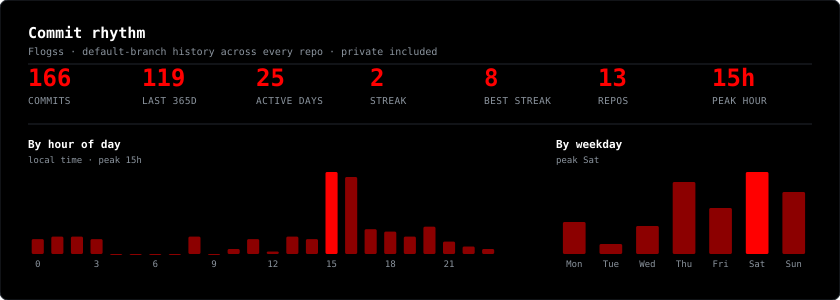

# `FLOGSS.exe`

**French dev 🇫🇷 — cybersec / OSINT / CTF / pentest**

---

## 🎯 What I work on

- **Offensive security** — CTF, pentest labs, OSINT investigation & recon tooling
- **Automation** — Discord / Telegram bots, scrapers, checkers, CI pipelines
- **Full-stack web** — Node.js APIs, Vue/Nuxt front-ends, self-hosted deployments
- **Hardware & systems** — customization, electronics repair, Arduino / embedded DIY

## 🧰 Stack

---

## 📊 Stats

> Generated every 6 hours by [`lowlighter/metrics`](https://github.com/lowlighter/metrics) — **private repos included**.

<!-- Commits, repos, stars, lines of code changed -->

<!-- Languages actually used in my commits -->

<!-- Full-year commit calendar -->

<!-- Total commits + when I commit: hours of the day, days of the week -->

### 🔥 Streak & activity

---

### 🏆 Achievements

 

⚠️ Everything published here is for educational and authorized security research only.

